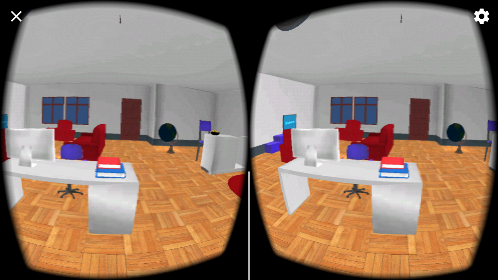

# VRApartment
This is a Virtual Reality  Apartment specially developed for Google Carboard.

## Technology Stack
- Unity
- GoogleVR SDK

#### How to run in Unity
 * [Download the project from github](https://github.com/vivekghanchi/VRApartment)
 * [Download Unity platform](https://unity3d.com/get-unity/download)
 * Import this project file into Unity. 
 
#### How to run Project on Android
* [Download the android application file from github](https://github.com/vivekghanchi/VRApartment/tree/master/APK)
* Install it on your Android phone.

## Screenshots

  

## Developer
- Vivek Ghanchi ([@vivekghanchi](https://github.com/vivekghanchi))
